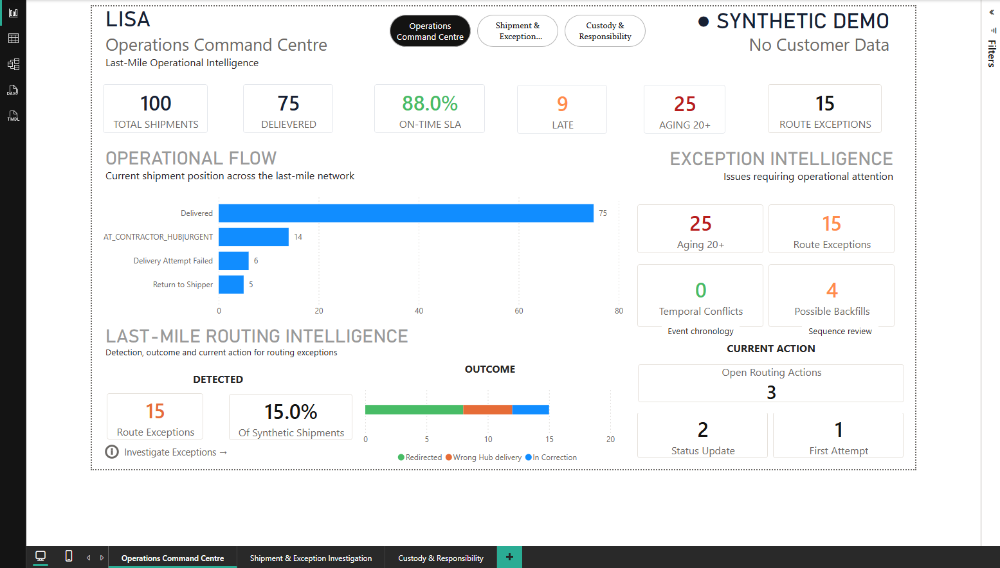
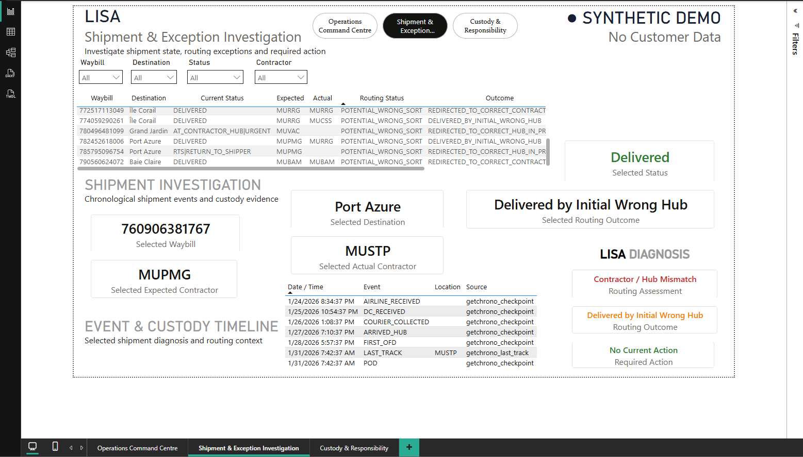
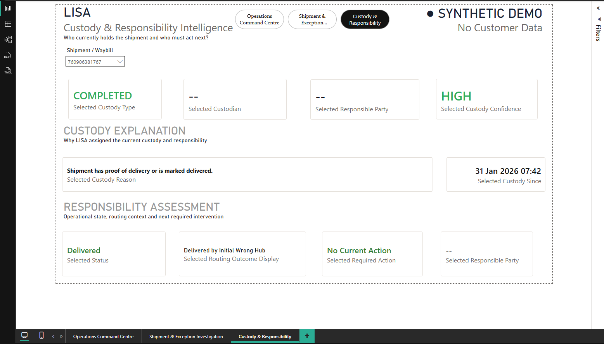

# LISA — Last-Mile Operational Intelligence & Shipment Analytics

[](https://github.com/andytechmoots/lisa-operational-intelligence-demo/actions/workflows/ci.yml)
[](https://lisa-logistics-intelligence-shipment-analytics.streamlit.app)

> **Public portfolio demonstration using synthetic data only.**

## Live Demo

Explore the interactive public demonstration:

**[Launch LISA Live Demo](https://lisa-logistics-intelligence-shipment-analytics.streamlit.app)**

The live application uses synthetic shipment data only and demonstrates:

- operations command-centre monitoring
- searchable shipment investigation
- routing-exception assessment
- custody and responsibility classification
- required operational action

LISA is a logistics intelligence platform designed to transform fragmented shipment tracking data into actionable operational insight.

It reconstructs shipment journeys, identifies routing exceptions, evaluates delivery performance, determines current custody and responsibility, and helps operators understand what action is required next.



## What Problem Does LISA Solve?

Shipment tracking systems often tell operations teams what events occurred, but not necessarily what those events mean operationally.

LISA is designed to answer questions such as:

- Which shipments require intervention?
- Was the shipment routed to the expected contractor?
- Has a wrong-sort been corrected?
- Who currently has custody?
- Who owns the next action?
- Which shipments are aging beyond service targets?
- Is the event sequence operationally trustworthy?

## Key Capabilities

### Operations Command Centre

Provides network-level visibility into:

- total shipments
- delivery performance
- SLA compliance
- aging exposure
- operational status
- routing exceptions
- open routing actions

### Shipment & Exception Investigation

Supports shipment-level investigation using:

- searchable waybill / connote
- operational status
- expected and actual routing
- routing diagnosis
- routing outcome
- required action
- event timeline
- lifecycle integrity signals

### Custody & Responsibility Intelligence

Determines:

- current custody type
- current custodian
- responsible party
- custody start time
- confidence level
- explainable custody reasoning

The goal is to answer a practical operational question:

> **Who is responsible for this shipment now, and what should happen next?**

## Public Demo Boundary

This repository contains the public demonstration layer of LISA.

Certain operational rule sets, route mappings, intelligence engines, validation logic, and production-oriented components are intentionally excluded from the public repository.

The public demo uses synthetic shipment data created specifically for development, testing, and portfolio presentation.

**No production customer data is included.**

## Dashboard

### Operations Command Centre


### Shipment & Exception Investigation



### Custody & Responsibility Intelligence



## Architecture

```text
Synthetic Shipment Data
          │
          ▼
    Ingestion Layer
          │
          ▼
 Transformation Layer
          │
     ┌────┴────┐
     ▼         ▼
Routing      Lifecycle
Analysis     Analysis
     │         │
     └────┬────┘
          ▼
 PostgreSQL Warehouse
          │
     ┌────┴────┐
     ▼         ▼
Custody      KPI Engine
Logic
     │         │
     └────┬────┘
          ▼
      Application Layer
        ┌───────┴────────┐
        ▼                ▼
   Streamlit Demo      Power BI
```

## Technology Stack

### Data & Backend

- Python
- PostgreSQL
- SQLAlchemy
- FastAPI

### Analytics

- Power BI
- DAX
- Power Query

### Engineering

- pytest
- Git / GitHub
- environment-based configuration
- deterministic synthetic demo pipeline
- automated regression testing

### Presentation & Deployment

- Streamlit
- Streamlit Community Cloud
- GitHub Actions CI

## Public Examples

The `examples/` directory contains simplified demonstrations of selected LISA concepts:

- `pipeline_example.py` — illustrates the high-level shipment processing flow
- `routing_example.py` — demonstrates simplified routing assessment
- `custody_example.py` — demonstrates simplified custody and responsibility assessment

These examples are intentionally separated from the private production-oriented implementation.

They demonstrate the analytical concepts without exposing proprietary rule sets or operational mappings.

## Validation

### Public Repository Validation

The public demonstration includes automated tests for the simplified routing and custody examples included in this repository.

| Validation | Result |
|---|---:|
| Public automated tests | 5 passing |
| Synthetic sample dataset | Included |
| GitHub Actions CI | Passing |

### Private Core Validation

The private LISA implementation is tested against a deterministic 100-shipment synthetic scenario.

| Metric | Result |
|---|---:|
| Synthetic shipments | 100 |
| Delivered | 75 |
| Routing exceptions | 15 |
| Completed custody | 75 |
| Contractor custody | 20 |
| Return flow | 5 |
| High-confidence custody decisions | 95 |
| Medium-confidence custody decisions | 5 |
| Missing custody classifications | 0 |
| Private-core automated tests | 11 passing |

The private core also validates logical consistency across shipment lifecycle, routing, custody, and responsibility states before the analytical layer is refreshed.

## Project Background

LISA was inspired by operational challenges encountered in parcel-network reporting and last-mile delivery environments.

The public demonstration was independently developed using synthetic data and generalized operational concepts.

It demonstrates applied:

- business systems analysis
- data engineering
- process improvement
- operational intelligence
- business intelligence product design

## Roadmap

Potential future development includes:

- role-based authentication
- secure demo deployment
- operational priority scoring
- configurable routing rules
- alerting and exception queues
- expanded routing intelligence
- additional network-performance intelligence

## Data & Privacy

This public repository contains **no real customer shipment data**.

Production datasets, credentials, private route mappings, detailed operational rules, database backups, proprietary decision logic, and private Power BI working files are excluded from version control.

The public repository intentionally demonstrates LISA's architecture and business value without exposing the complete proprietary intelligence engine.

## Author

**Andy R.M. Mooteealoo**

Business Systems / Data & Business Intelligence Analyst

Python • SQL • Power BI • Process Improvement • Automation

Built as a portfolio demonstration of applied logistics analytics, business systems analysis, and operational intelligence.